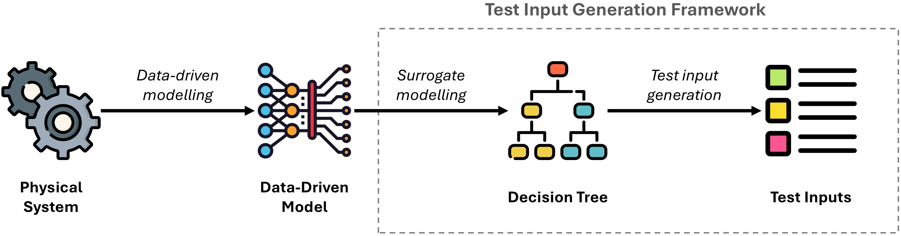

# Data-Driven Test Input Generation

This example demonstrates how to use the framework to generate test inputs from a Flowcean model. It performs the following steps:

- Constructs a Flowcean model using a sample configuration.
- Generates test inputs based on the Flowcean model.
- Executes the test inputs on the Flowcean model.
- Checks if the predicate is violated.

## Idea behind DDTIG

The framework utilizes decision trees as white-box models to guide the generation of test inputs. Specifically, it partitions the input domain of the System Under Test (SUT) into equivalence classes based on the internal structure of the decision tree. Each class represents a group of inputs that follow the same decision path in the tree.

Test inputs are sampled statistically from each class, guided by decision tree coverage criteria and the distribution of samples across leaf nodes. If the model is not already a decision tree, the framework uses a method for training a decision tree surrogate from any given data-driven model. Surrogate models are simplified analytical representations that approximate the behavior of complex, computationally intensive models. The resulting surrogate allows the framework to be applied across various types of data-driven models.



## Key Features
- Supports Boundary Value Analysis and Decision Tree Coverage
- Extracts equivalence classes from model structure
- Generates test inputs from extracted equivalence classes


## Specifying System Specifications

To generate test inputs using the framework, you can define system specifications in a JSON file. This file describes the input features of your CPS and their constraints.

### JSON Structure

- The outermost key must be `"features"`, whose value is a list of feature objects.
- Each feature object must include the following keys:
  - `"name"` *(string)*: Name of the feature
  - `"min"` *(int or float)*: Minimum value allowed
  - `"max"` *(int or float)*: Maximum value allowed
  - `"type"` *(either `"int"` or `"float"`)*: Data type of the feature
  - `"nominal"` *(boolean)*: Indicates whether the feature is nominal

> [!IMPORTANT]
> The order of features in the list must match the column order in the training datasets used to generate the Flowcean model.

### 🧾 Example

```json
{
  "features": [
    {
      "name": "Weight",
      "min": 0,
      "max": 3,
      "type": "int",
      "nominal": false
    },
    {
      "name": "Acidity",
      "min": 0.2,
      "max": 5.36,
      "type": "float",
      "nominal": false
    },
    {
      "name": "Color",
      "min": 0,
      "max": 4,
      "type": "int",
      "nominal": true
    }
  ]
}
```

### When Is This File Required?

A system specification file is **required** to ensure the framework understands the valid input ranges and types for each feature.

However, if you provide a dataset containing **system inputs and outputs** that already encodes the necessary specifications, then you **do not need** to supply a separate system specification file.


## Parameter Overview

#### ❗ Required Parameters

- `test_coverage_criterium` *(string)*: Strategy for test coverage. Must be either `"bva"` (Boundary Value Analysis) or `"dtc"` (Decision Tree Coverage).
- `n_testinputs` *(int)*: Total number of test inputs to generate.
- `dataset` or [`specs_file`](#specifying-system-specifications) must be provided to specify input features of the CPS.

#### ⚙️ Optional Parameters

- `classification`*(boolean)*: Specify whether the task is a classification problem. **Default**: `false`
- `inverse_alloc` *(boolean)*: If `true`, use inverse test allocation strategy. **Default**: `false`
- `epsilon` *(float)*: Size of the interval around boundaries for BVA testing. **Default**: `0.5`

#### 🧠 For Surrogate Modelling Process

- `performance_threshold` *(float, optional)*: Minimum performance required to export the Hoeffding Tree. **Default**: `0.3`
- `sample_limit` *(int, optional)*: Maximum number of samples used to train the Hoeffding Tree. **Default**: `50000`
- `n_predictions` *(int, optional)*: Number of correct predictions required before exporting the Hoeffding Tree. **Default**: `50`
- `max_depth` *(int, optional)*: Maximum depth of the Hoeffding Tree. **Default**: `5`


## Create a Model for Testing

In this example we can use either a regression tree or a neural network to create a model for testing. DDTIG can extract features from a regression tree directly, whereas for the neural network it will automatically create a surrogate model.

```python
# Create a regression tree using Flowcean
# optional: Adjust "max_depth" to control the maximum depth of the
#             decision tree

# learner = RegressionTree(max_depth=7)

# optional: To use a neural network instead, uncomment the block below,
#             and comment out other model definitions.
#             Modify hyperparameters such as "learning_rate",
#             "hidden_dimensions" and "max_epochs" as needed.
#             Refer to the Flowcean documentation for details.
learner = LightningLearner(
    module=MultilayerPerceptron(
        learning_rate=1e-3,
        output_size=len(outputs),
        hidden_dimensions=[10, 10],
    ),
    max_epochs=5,
)

# Train the model
model = learn_offline(
    data,
    learner,
    inputs,
    outputs,
    )
```

## Generate Test Inputs

First, the test generator is created with the following code. The generated inputs are saved to a CSV. This operation iterates over all values, so the generator has to be reset to point at the first values again.

```python
test_generator = DDTIGenerator(
    model,
    n_testinputs=1000,
    test_coverage_criterium="dtc",
    dataset=df,
    epsilon=1.0,
    max_depth=7,
)
test_generator.save_csv("test_inputs.csv")
test_generator.reset()

# optional: Uncomment to get more detailed outputs to files
# test_generator.print_hoeffding_tree()
# test_generator.print_eqclasses()
# test_generator.print_testplans()
```

By uncommenting the function calls more insights into the input generation and the underlying model tree can be gained.

## Testing the Model

The generated test cases are executed and the results are checked against the predicate. The predicate can either be concrete values or expressions that should evaluate to true for all test cases.

```python

predicate = PolarsPredicate(
    (pl.col("BodyFat") < BODYFAT_MAX) & (pl.col("BodyFat") > BODYFAT_MIN),
)

run_model_tests(
    model,
    test_generator,
    predicate,
    show_progress=True,
    stop_after=40,
    path="test_failures.txt",
)

```


## Run this example

To run this example first make sure you followed the [installation instructions](../getting_started/prerequisites.md) to setup python and `just`.
Afterwards you can either use `just` or run the examples from source.

### Just

The easiest way to run this example is using `just`.
Follow the [installation guide](../getting_started/installation.md) to clone Flowcean but stop before installing it or any of its dependencies.
Now you can run the example using

```sh
just examples-ddtig
```

This command will take care of installing any required dependencies in a separate environment.
After a short moment you should see the learning results from both methods and the achieved metric values.

### From source

Follow the [installation guide](../getting_started/installation.md) to install Flowcean and it's dependencies from source.
Afterwards you can navigate to the `examples` folder and run the examples.

```sh
cd examples/ddtig
python run.py
```
