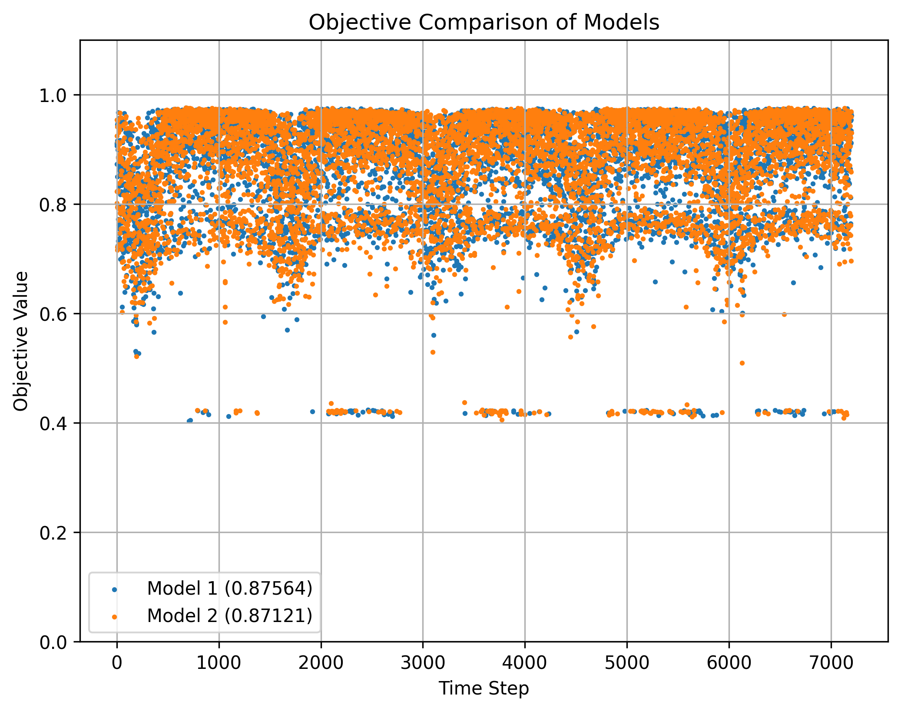
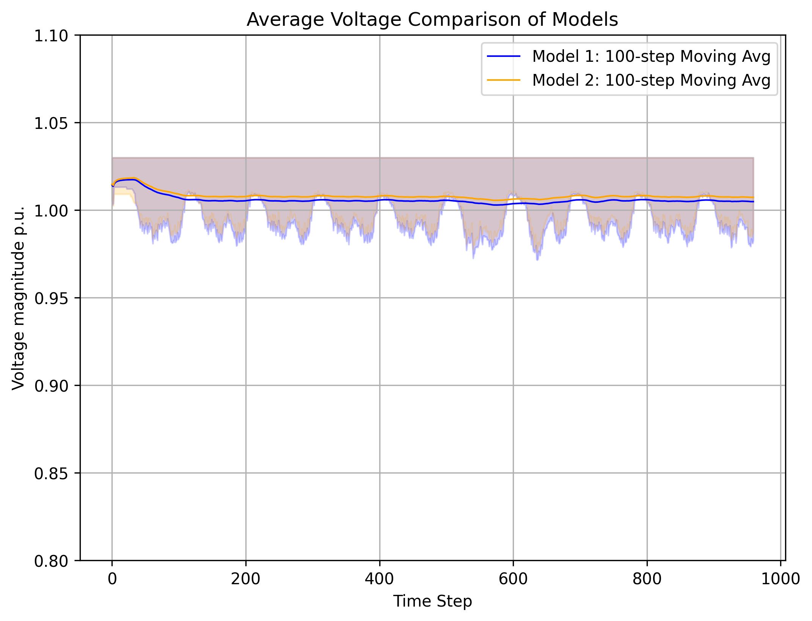

# Energy System Example

Energy systems are highly complex systems with lots of parameters.
Consequently, there are many different use cases and problems that need to be solved.
For this example, a specific use case in the electrical power grid will be demonstrated: grid stability through voltage control.

## Background

Power grids are basically graphs, with nodes being bus bars and edges being lines, which connect the bus bars with each other.
Knowing the voltage at these bus bars is essential for load and generation forecast, but usually the voltage is not available as measurement, only power.
To perform a power flow calculation to retrieve the voltages, one node will be declared as slack node.
The voltage of the other nodes will be calculated in relation to the slack node. 
Therefore, those voltages will be handled as *Voltage magnitude per unit*, with the optimal value generally being 1.0.

## Task

In this example, a model will be trained that aims to keep the voltage at 1.0 p.u. on a simulation model of the power grid.
Therefore, an active learner is required, which will be taken from the [palaestrAI](https://docs.palaestr.ai).
The following code example will show the essential steps only, the full code is available within the examples of the flowcean source distribution.

The power grid can be loaded with

```python
environment = EnergySystemActive(
    "agenc_demo_training",
    "training_results.csv,
    scenario_file="data/midas_scenario.yml",
    reward_func=calculate_reward,
    end=1800,
)

```
Here, `calculate_reward` is a function that turns a list of sensors objects into a list of rewards (which are both `Interface` objects in flowcean).
This function is environment-specific and even use-case-specific, as it describes the state of the environment with a certain goal in mind.
Among other things, the specific function here calculates the average voltage magnitude over all buses. 

Next, the learner has to be created

```python
from midas_palaestrai import ArlDefenderObjective

# Names of the actuators in the environment; 
# these define what the model can DO
actuator_ids = [
    "Powergrid-0.0-storage-0-1.p_mw",
    "Powergrid-0.0-storage-1-3.p_mw",
    # ... skipped 
    "Powergrid-0.0-trafo-1.delta_tap_pos",
]

# Names of the sensors in the environment; 
# these define what the model can SEE
sensor_ids = [
    "Powergrid-0.0-bus-0.vm_pu",
    # ... skipped
    "Powergrid-0.0-storage-12-14.q_mvar",
]

params = {
    "update_after": 10000,
    "update_every": 1000,
    "batch_size": 100,
    "fc_dims": (256, 256, 256),
}

learner = SACLearner(
    actuator_ids,
    sensor_ids,
    ArlDefenderObjective(),  # Objective function for voltage stability
    **params
)
```

As with the other examples, running the learning and evaluation processes with flowcean is rather simple.
But first, at least one metric for the evaluation is required.
For this example, a metric will be created that calculates the RMSE between each buses' voltage magnitude p.u. and 1.0.


```python
from flowcean.core.metrics import ActiveMetric

class VoltageDeviation(ActiveMetric):
    @override
    def __call__(self observations: list[Observation], action: list[Action]) -> Any:
        values = []
        for observation in observations[1:]:
            vm_pu_mse = [
                (1.0 - sensor.value) ** 2
                for sensor in observation.sensors
                if "vm_pu" in sensor.uid
            ]
            values.append(math.sqrt(sum(vm_pu_mse) / len(vm_pu_mse)))
        return sum(values) / len(values)
```

For the actual training and evaluation, the `learn_active` and `evaluate_active` strategies are required.

```python
from flowcean.core.strategies.active import learn_active, evaluate_active

model = learn_active(environment, learner)

# Setup a new environment similar to the first one;
# since it is a simulation environment, it cannot be simply used again
environment2 = EnergySystemActive(
    "agenc_demo",  # this actually uses a different time resolution
    "test_results.csv",
    scenario_file="data/midas_scenario.yml",
    reward_func=calculate_reward,
    end=1800,
)
report = evaluate_active(environment2, model, [VoltageDeviation()])

print(report)
```
Result: 
```bash
VoltageDeviation: 0.022040343118938252
```

## Ensemble: Comparing different models

With flowcean and some loops it is possible to compare different models on the energy system environment.
Since there is currently only one active learner, different learning parameters will be used to create different models.

```python
learning_params = [
    {
        "update_after": 10000,
        "update_every": 1000,
        "batch_size": 100,
        "fc_dims": (256, 256, 256),
    },
    {
        "update_after": 1000,
        "update_every": 100,
        "batch_size": 100,
        "fc_dims": (128, 128),
    },
]
```

First, in the training process the models calculate the rewards in each step. 
This is shown in the following figure for each model




For the evaluation, three more metrics will be created.

- `VoltagePeaks` contains the maximum voltages of the whole simulation - 1
- `VoltageDrops` contains 1 - the minimum voltage of the whole simulation
- `LineLoading` contains the average loading on the lines

For all metrics holds true that lower = better.
The results are shown the following table

| Model   | VoltageDeviation | VoltagePeaks | VoltageDrops | LineLoadings |
| ------- | ----------------:| ------------:| ------------:| ------------:|
| Model 0 |          0.01626 |      0.03000 |      0.02852 |     15.99515 |
| Model 1 |          0.01589 |      0.03019 |      0.02418 |     14.51645 |

The following figures shows the voltage metrics as plots over time, which give an better estimate on the quality than the metric values itself



It can be seen that both models are comparable in the performance and both models learned the task at hand.

## Additional Note

The training takes a considerable amount of time.
The code in the example runs only for a short period of time, while the plots shown here from a training run with more simulation steps.