# Hybrid Systems Gallery

These examples illustrate switching, hysteresis, and resets in hybrid systems, from a bouncing ball to a controlled wind turbine.

## What the Examples Illustrate

| Example | Behavior |
| --- | --- |
| [Thermostat](#thermostat) | Hysteresis around a moving target |
| [Bouncing ball](#bouncing-ball) | Velocity resets at impact |
| [Hybrid oscillator](#hybrid-oscillator) | Side-dependent damping |
| [Switched linear](#switched-linear) | State-triggered switching of linear dynamics |
| [Relay integrator](#relay-integrator) | Relay control with hysteresis |
| [Time-varying event surface](#time-varying-event-surface) | Switching at an externally driven boundary |
| [Time-forced switch](#time-forced-switch) | Periodic switching with a clock state |
| [Piecewise affine](#piecewise-affine) | Affine dynamics and a linear event surface |
| [Impact oscillator](#impact-oscillator) | Forced oscillation with impact resets |
| [PID-controlled plant](#pid-controlled-plant) | Actuator saturation and integral control |
| [Tank valves](#tank-valves) | Valve switching and gravity-driven drainage |
| [Location cycle](#location-cycle) | Clock-driven switching with resets |
| [Buck converter](#buck-converter) | Hysteretic switching and diode blocking |
| [Wind turbine](#wind-turbine) | Torque regimes and pitch control |

## Thermostat

A heater switches on and off around a target temperature. Heat loss to the surroundings continues in both locations. The input moves the switching thresholds; it does not directly change the heating or cooling dynamics.

For temperature $T$, ambient temperature $T_a$, heat-loss coefficient $k$, and heating contribution $P$,

$$
\dot{T} =
\begin{cases}
-k(T - T_a) + P, & \text{heating}, \\
-k(T - T_a), & \text{cooling}.
\end{cases}
$$

For target temperature $r(t)$ and hysteresis half-width $b$, a rising zero crossing of $T-(r+b)$ switches to cooling; a falling zero crossing of $T-(r-b)$ switches back to heating. Neither transition resets the temperature.

<figure class="hybrid-figure hybrid-automaton" markdown="span">

[](../assets/hybrid_systems/thermostat-automaton.svg){ target="_blank" rel="noopener" }

<figcaption>The incoming arrow marks the initial heating location. The separate switching boundaries create hysteresis. Open a figure to inspect it at full size.</figcaption>

</figure>

The illustrated run uses a varying target temperature:

<figure class="hybrid-figure" markdown="span">

[](../assets/hybrid_systems/thermostat-trace.svg){ target="_blank" rel="noopener" }

<figcaption>Temperature remains continuous at each switch. The hysteresis band allows it to move around the target rather than track it exactly. Mode colors match the diagram.</figcaption>

</figure>

See the [`thermostat` factory](../reference/hybrid.md#flowcean.hybrid.benchmarks.thermostat.thermostat) for parameter options and the [simulation guide](../user_guide/hybrid_systems.md#simulation) for a runnable example.

## Bouncing Ball

A hybrid system can jump without changing its location. This ball has only one location, `flight`; impact applies a velocity reset and returns to that same location.

The state is height and vertical velocity, $[h,v]$. Between impacts,

$$
\dot{h}=v, \qquad \dot{v}=-g.
$$

A falling zero crossing of $h$ detects ground impact. The reset leaves height unchanged and maps velocity to $v^+=-e v^-$, where $e$ is the restitution coefficient. There is no resting location in this model.

<figure class="hybrid-figure hybrid-automaton" markdown="span">

[](../assets/hybrid_systems/bouncing_ball-automaton.svg){ target="_blank" rel="noopener" }

<figcaption>The self-loop changes the continuous state without introducing another mode.</figcaption>

</figure>

The illustrated ball is dropped from rest and loses energy at each bounce. Height is interpreted in metres and time in seconds.

<figure class="hybrid-figure" markdown="span">

[](../assets/hybrid_systems/bouncing_ball-trace.svg){ target="_blank" rel="noopener" }

<figcaption>Dashed lines join the velocities immediately before and after each impact at the same physical time. They represent resets, not continuous motion through those values.</figcaption>

</figure>

See the [`bouncing_ball` factory](../reference/hybrid.md#flowcean.hybrid.benchmarks.bouncing_ball.bouncing_ball) for gravity, restitution, and initial-state options.

## Hybrid Oscillator

An oscillator changes its damping when position crosses the origin. The `left` and `right` locations use different damping coefficients but share the same restoring law. Neither position nor velocity is reset at a switch.

<figure class="hybrid-figure hybrid-automaton" markdown="span">

[](../assets/hybrid_systems/hybrid_oscillator-automaton.svg){ target="_blank" rel="noopener" }

<figcaption>Crossing the origin changes the damping law; it is not an impact.</figcaption>

</figure>

<figure class="hybrid-figure" markdown="span">

[](../assets/hybrid_systems/hybrid_oscillator-trace.svg){ target="_blank" rel="noopener" }

<figcaption>The location changes at each position-zero crossing while both state coordinates remain continuous.</figcaption>

</figure>

See the [`hybrid_oscillator` factory](../reference/hybrid.md#flowcean.hybrid.benchmarks.hybrid_oscillator.hybrid_oscillator) for parameters.

## Switched Linear

This system selects between two linear flows, $\dot{x}=A_qx$, where $q$ is the active location. A downward crossing of the first coordinate through a threshold selects `off`; an upward crossing selects `on`. These are names for the two dynamics, not an external control input.

<figure class="hybrid-figure hybrid-automaton" markdown="span">

[](../assets/hybrid_systems/switched_linear-automaton.svg){ target="_blank" rel="noopener" }

<figcaption>Both directions use the same threshold, rather than a hysteresis band.</figcaption>

</figure>

<figure class="hybrid-figure" markdown="span">

[](../assets/hybrid_systems/switched_linear-trace.svg){ target="_blank" rel="noopener" }

<figcaption>The threshold crossings select the active matrix. Switching changes the dynamics without resetting the state.</figcaption>

</figure>

See the [`switched_linear` factory](../reference/hybrid.md#flowcean.hybrid.benchmarks.switched_linear.switched_linear) for matrix and threshold options.

## Relay Integrator

An integrator alternates between positive and negative constant rates. A rising crossing of the upper bound switches from `up` to `down`; a falling crossing of the lower bound switches back. The separated bounds create hysteresis.

<figure class="hybrid-figure hybrid-automaton" markdown="span">

[](../assets/hybrid_systems/relay_integrator-automaton.svg){ target="_blank" rel="noopener" }

<figcaption>Switching reverses the direction of evolution, not the value of the integrated state.</figcaption>

</figure>

<figure class="hybrid-figure" markdown="span">

[](../assets/hybrid_systems/relay_integrator-trace.svg){ target="_blank" rel="noopener" }

<figcaption>Constant-rate segments meet at the switching bounds without state jumps.</figcaption>

</figure>

See the [`relay_integrator` factory](../reference/hybrid.md#flowcean.hybrid.benchmarks.relay_integrator.relay_integrator) for slope and bound options.

## Time-Varying Event Surface

An input signal moves the switching boundaries around the first state coordinate. The locations apply opposing drift terms and shared damping; the input changes the event surfaces, not the flow laws. The second coordinate decays independently.

<figure class="hybrid-figure hybrid-automaton" markdown="span">

[](../assets/hybrid_systems/time_varying_event_surface-automaton.svg){ target="_blank" rel="noopener" }

<figcaption>Crossing direction is measured relative to the moving boundary, not from the direction of state motion alone.</figcaption>

</figure>

<figure class="hybrid-figure" markdown="span">

[](../assets/hybrid_systems/time_varying_event_surface-trace.svg){ target="_blank" rel="noopener" }

<figcaption>The moving band changes when switching occurs. The plotted coordinate remains continuous as the active drift changes.</figcaption>

</figure>

See the [`time_varying_event_surface` factory](../reference/hybrid.md#flowcean.hybrid.benchmarks.time_varying_event_surface.time_varying_event_surface) for its threshold input and parameters.

## Time-Forced Switch

A clock is part of the continuous state. It advances uniformly and resets when it reaches the dwell time, alternating between `fast` and `slow`. The other coordinates approach zero more quickly in `fast` than in `slow`. The factory's `period` spans a complete fast-slow cycle.

<figure class="hybrid-figure hybrid-automaton" markdown="span">

[](../assets/hybrid_systems/time_forced_switch-automaton.svg){ target="_blank" rel="noopener" }

<figcaption>Both transitions use the same clock condition. The decaying coordinates are not reset.</figcaption>

</figure>

<figure class="hybrid-figure" markdown="span">

[](../assets/hybrid_systems/time_forced_switch-trace.svg){ target="_blank" rel="noopener" }

<figcaption>Dashed vertical segments indicate clock resets. Physical simulation time continues forward along the horizontal axis.</figcaption>

</figure>

See the [`time_forced_switch` factory](../reference/hybrid.md#flowcean.hybrid.benchmarks.time_forced_switch.time_forced_switch) for period and initial-state options.

## Piecewise Affine

Each location $q$ defines an affine flow,

$$
\dot{x}=A_qx+b_q,
$$

with a matrix $A_q$ and an offset $b_q$. Crossing a threshold with the first coordinate selects `left` or `right`. The threshold is shared by both directions; switching does not reset the state.

<figure class="hybrid-figure hybrid-automaton" markdown="span">

[](../assets/hybrid_systems/piecewise_affine-automaton.svg){ target="_blank" rel="noopener" }

<figcaption>Each location can supply both a linear state term and a constant offset.</figcaption>

</figure>

<figure class="hybrid-figure" markdown="span">

[](../assets/hybrid_systems/piecewise_affine-trace.svg){ target="_blank" rel="noopener" }

<figcaption>The displayed configuration is the linear special case, with both offsets zero. The trajectories remain continuous across switches.</figcaption>

</figure>

See the [`piecewise_affine` factory](../reference/hybrid.md#flowcean.hybrid.benchmarks.piecewise_affine.piecewise_affine) for matrices, offsets, and threshold options.

## Impact Oscillator

A damped oscillator is driven by a time-varying force and collides with a stop. Position and velocity evolve continuously between impacts. A falling position-zero crossing applies the reset $v^+=-e v^-$, leaving position unchanged and remaining in the same `oscillate` location.

<figure class="hybrid-figure hybrid-automaton" markdown="span">

[](../assets/hybrid_systems/impact_oscillator-automaton.svg){ target="_blank" rel="noopener" }

<figcaption>The input force acts between impacts; the reset acts at the stop. Neither introduces another location.</figcaption>

</figure>

<figure class="hybrid-figure" markdown="span">

[](../assets/hybrid_systems/impact_oscillator-trace.svg){ target="_blank" rel="noopener" }

<figcaption>Dashed segments mark instantaneous velocity resets. Forcing can replenish energy between impacts, so successive excursions need not shrink monotonically.</figcaption>

</figure>

See the [`impact_oscillator` factory](../reference/hybrid.md#flowcean.hybrid.benchmarks.impact_oscillator.impact_oscillator) for the force input and model parameters.

## PID-Controlled Plant

A PID controller drives a second-order plant. Its state contains position, velocity, and the integral of tracking error. The input supplies a reference and its time derivative.

The active location determines whether actuation follows the raw PID command or is clamped at an upper or lower limit. Crossing a limit switches between linear and saturated operation without resetting the state.

<figure class="hybrid-figure hybrid-automaton" markdown="span">

[](../assets/hybrid_systems/pid_controlled_plant-automaton.svg){ target="_blank" rel="noopener" }

<figcaption>Transition conditions use the unclamped command, even while the applied actuation is limited.</figcaption>

</figure>

<figure class="hybrid-figure" markdown="span">

[](../assets/hybrid_systems/pid_controlled_plant-trace.svg){ target="_blank" rel="noopener" }

<figcaption>The integral continues evolving during saturation. This benchmark does not freeze the integrator or provide an anti-windup correction.</figcaption>

</figure>

See the [`pid_controlled_plant` factory](../reference/hybrid.md#flowcean.hybrid.benchmarks.pid_controlled_plant.pid_controlled_plant) for gains, actuation limits, and input requirements.

## Tank Valves

A pump feeds the first tank while an outlet drains the second. A valve between them opens and closes according to the first tank's level. When open, it permits one-way transfer driven by the level difference.

Closed operation distinguishes a wet second tank from an empty one. When that tank drains to zero, a reset sets its level exactly to zero and the `closed_dry` location holds it there until the valve opens.

<figure class="hybrid-figure hybrid-automaton" markdown="span">

[](../assets/hybrid_systems/tank_valves-automaton.svg){ target="_blank" rel="noopener" }

<figcaption>Either closed location can open the valve. Opening permits transfer but does not guarantee that tank 2 fills faster than it drains.</figcaption>

</figure>

<figure class="hybrid-figure" markdown="span">

[](../assets/hybrid_systems/tank_valves-trace.svg){ target="_blank" rel="noopener" }

<figcaption>In this run, tank 2 empties before every valve opening. Its zero-level plateaus belong to the closed-dry location.</figcaption>

</figure>

See the [`tank_valves` factory](../reference/hybrid.md#flowcean.hybrid.benchmarks.tank_valves.tank_valves) for tank geometry, flow parameters, and switching levels.

## Location Cycle

Locations form a cyclic sequence, each applying a different linear flow to the non-clock coordinates. A dwell clock triggers the next location and resets after each handoff. The factory can vary both the number of locations and the non-clock state dimension.

<figure class="hybrid-figure hybrid-automaton" markdown="span">

[](../assets/hybrid_systems/mode_cycle-automaton.svg){ target="_blank" rel="noopener" }

<figcaption>The final location returns to the first. The other state coordinates are carried through every transition unchanged.</figcaption>

</figure>

<figure class="hybrid-figure" markdown="span">

[](../assets/hybrid_systems/mode_cycle-trace.svg){ target="_blank" rel="noopener" }

<figcaption>Separate scales reveal the smaller coordinate excursions. Only the clock jumps at a location change; its reset does not restart the other trajectories.</figcaption>

</figure>

See the [`mode_cycle` factory](../reference/hybrid.md#flowcean.hybrid.benchmarks.mode_cycle.mode_cycle) for location count, state dimension, and dwell-time options.

## Buck Converter

A buck converter alternates between connecting the supply and letting inductor current freewheel through a diode. Voltage hysteresis determines when the switch opens and closes; there is no fixed-frequency clock.

When the freewheeling current reaches zero, the diode blocks reverse current. The capacitor then supplies the load until output voltage falls to the lower switching threshold.

<figure class="hybrid-figure hybrid-automaton" markdown="span">

[](../assets/hybrid_systems/buck_converter-automaton.svg){ target="_blank" rel="noopener" }

<figcaption>The off location can return directly to on or pass through zero-current operation first.</figcaption>

</figure>

<figure class="hybrid-figure" markdown="span">

[](../assets/hybrid_systems/buck_converter-trace.svg){ target="_blank" rel="noopener" }

<figcaption>Here, each cycle includes a zero-current interval. Voltage can continue rising after switch-off as stored inductor energy feeds the output: the thresholds are switching commands, not hard voltage bounds.</figcaption>

</figure>

See the [`buck_converter` factory](../reference/hybrid.md#flowcean.hybrid.benchmarks.buck_converter.buck_converter) for circuit parameters, conduction laws, and threshold options.

## Wind Turbine

This already-running turbine couples rotor motion, tower motion, and blade-pitch control. Its controller switches between generator torque laws without resetting the continuous state.

The state captures rotor speed, tower displacement and velocity, blade pitch and pitch rate, and the pitch controller's integral contribution. The input is wind speed. Generator speed determines the active torque regime; pitch control operates across all regimes.

<figure class="hybrid-figure hybrid-automaton" markdown="span">

[](../assets/hybrid_systems/wind_turbine-automaton.svg){ target="_blank" rel="noopener" }

<figcaption>Rising generator speed moves the controller toward rated power; falling speed moves it back toward no generation. Separate thresholds in each direction provide hysteresis.</figcaption>

</figure>

In the illustrated run, wind speed rises and then falls. The plots show how the rotor, pitch controller, and tower respond:

<figure class="hybrid-figure" markdown="span">

[](../assets/hybrid_systems/wind_turbine-trace.svg){ target="_blank" rel="noopener" }

<figcaption>The dashed line marks rated generator-shaft power. This is mechanical power, not electrical output, and the reference is not a hard instantaneous cap in other modes. Mode colors match the diagram.</figcaption>

</figure>

The model assumes quasi-steady, head-on aerodynamics and a running rotor. It does not model startup, shutdown, or emergency braking. Aerodynamic-domain violations stop simulation rather than extrapolating the fitted coefficients. See the [wind-turbine reference](../reference/hybrid.md#flowcean.hybrid.benchmarks.wind_turbine.wind_turbine) for equations, controller parameters, and operating limits.

Run the standalone example to print mode changes and save a plot:

```bash
uv run --directory ./examples/hybrid_systems python wind_turbine.py
```

Its output is `examples/hybrid_systems/outputs/wind_turbine.png`.

## Run the Gallery

Run every configured example and save a combined plot to `examples/hybrid_systems/outputs/benchmarks.png`:

```bash
uv run --directory ./examples/hybrid_systems python run.py
```

The model configurations and input signals are in [`scenarios.py`](https://github.com/flowcean/flowcean/blob/main/examples/hybrid_systems/scenarios.py).

To work with an installed Flowcean package rather than the repository scripts, start with the [simulation example](../user_guide/hybrid_systems.md#simulation). The [identification walkthrough](simulated_hybrid_system.md) shows how to learn a hybrid model from simulated traces.

## Export Automaton Diagrams

To inspect the implemented models, export every example's declared automaton without simulating it:

```bash
uv run --directory ./examples/hybrid_systems python export_graphs.py
```

This writes one DOT file per example under `examples/hybrid_systems/outputs/automata/`. Add `--svg` to render SVG files; this requires Graphviz's `dot` executable on `PATH`.

See [Automaton Diagrams](../user_guide/hybrid_systems.md#automaton-diagrams) for the export API and label options.
