# Hybrid Systems Gallery

These examples illustrate switching, hysteresis, and resets in hybrid systems, from a bouncing ball to a controlled wind turbine.

## What the Examples Illustrate

| Example | Behavior |
| --- | --- |
| [Bouncing ball](#bouncing-ball) | Velocity resets at impact |
| [Thermostat](#thermostat) | Hysteresis around a moving target |
| [Hybrid oscillator](../reference/hybrid.md#flowcean.hybrid.benchmarks.hybrid_oscillator.hybrid_oscillator) | Side-dependent damping |
| [Switched linear](../reference/hybrid.md#flowcean.hybrid.benchmarks.switched_linear.switched_linear) | State-triggered switching of linear dynamics |
| [Relay integrator](../reference/hybrid.md#flowcean.hybrid.benchmarks.relay_integrator.relay_integrator) | Relay control with hysteresis |
| [Time-varying event surface](../reference/hybrid.md#flowcean.hybrid.benchmarks.time_varying_event_surface.time_varying_event_surface) | Switching at an externally driven boundary |
| [Time-forced switch](../reference/hybrid.md#flowcean.hybrid.benchmarks.time_forced_switch.time_forced_switch) | Periodic switching with a clock state |
| [Piecewise affine](../reference/hybrid.md#flowcean.hybrid.benchmarks.piecewise_affine.piecewise_affine) | Affine dynamics and a linear event surface |
| [Impact oscillator](../reference/hybrid.md#flowcean.hybrid.benchmarks.impact_oscillator.impact_oscillator) | Forced oscillation with impact resets |
| [PID-controlled plant](../reference/hybrid.md#flowcean.hybrid.benchmarks.pid_controlled_plant.pid_controlled_plant) | Actuator saturation and integral control |
| [Tank valves](../reference/hybrid.md#flowcean.hybrid.benchmarks.tank_valves.tank_valves) | Valve switching and gravity-driven drainage |
| [Location cycle](../reference/hybrid.md#flowcean.hybrid.benchmarks.mode_cycle.mode_cycle) | Clock-driven switching with resets |
| [Buck converter](../reference/hybrid.md#flowcean.hybrid.benchmarks.buck_converter.buck_converter) | Hysteretic switching and diode blocking |
| [Wind turbine](#wind-turbine) | Torque regimes and pitch control |

## Thermostat

A heater switches on and off around a target temperature. Heat loss to the surroundings continues in both locations. The input moves the switching thresholds; it does not directly change the heating or cooling dynamics.

For temperature $T$, ambient temperature $T_a$, heat-loss coefficient $k$, and heating contribution $P$,

$$
\dot{T} =
\begin{cases}
-k(T - T_a) + P, & \text{heating}, \\
-k(T - T_a), & \text{cooling}.
\end{cases}
$$

For target temperature $r(t)$ and hysteresis half-width $b$, a rising zero crossing of $T-(r+b)$ switches to cooling; a falling zero crossing of $T-(r-b)$ switches back to heating. Neither transition resets the temperature.

<figure class="hybrid-figure hybrid-automaton" markdown="span">

[](../assets/hybrid_systems/thermostat-automaton.svg){ target="_blank" rel="noopener" }

<figcaption>The incoming arrow marks the initial heating location. The separate switching boundaries create hysteresis. Open a figure to inspect it at full size.</figcaption>

</figure>

The illustrated run uses a varying target temperature:

<figure class="hybrid-figure" markdown="span">

[](../assets/hybrid_systems/thermostat-trace.svg){ target="_blank" rel="noopener" }

<figcaption>Temperature remains continuous at each switch. The hysteresis band allows it to move around the target rather than track it exactly. Mode colors match the diagram.</figcaption>

</figure>

See the [`thermostat` factory](../reference/hybrid.md#flowcean.hybrid.benchmarks.thermostat.thermostat) for parameter options and the [simulation guide](../user_guide/hybrid_systems.md#simulation) for a runnable example.

## Bouncing Ball

A hybrid system can jump without changing its location. This ball has only one location, `flight`; impact applies a velocity reset and returns to that same location.

The state is height and vertical velocity, $[h,v]$. Between impacts,

$$
\dot{h}=v, \qquad \dot{v}=-g.
$$

A falling zero crossing of $h$ detects ground impact. The reset leaves height unchanged and maps velocity to $v^+=-e v^-$, where $e$ is the restitution coefficient. There is no resting location in this model.

<figure class="hybrid-figure hybrid-automaton" markdown="span">

[](../assets/hybrid_systems/bouncing_ball-automaton.svg){ target="_blank" rel="noopener" }

<figcaption>The self-loop changes the continuous state without introducing another mode.</figcaption>

</figure>

The illustrated ball is dropped from rest and loses energy at each bounce. Height is interpreted in metres and time in seconds.

<figure class="hybrid-figure" markdown="span">

[](../assets/hybrid_systems/bouncing_ball-trace.svg){ target="_blank" rel="noopener" }

<figcaption>Dashed lines join the velocities immediately before and after each impact at the same physical time. They represent resets, not continuous motion through those values.</figcaption>

</figure>

See the [`bouncing_ball` factory](../reference/hybrid.md#flowcean.hybrid.benchmarks.bouncing_ball.bouncing_ball) for gravity, restitution, and initial-state options.

## Wind Turbine

This already-running turbine couples rotor motion, tower motion, and blade-pitch control. Its controller switches between generator torque laws without resetting the continuous state.

The state captures rotor speed, tower displacement and velocity, blade pitch and pitch rate, and the pitch controller's integral contribution. The input is wind speed. Generator speed determines the active torque regime; pitch control operates across all regimes.

<figure class="hybrid-figure hybrid-automaton" markdown="span">

[](../assets/hybrid_systems/wind_turbine-automaton.svg){ target="_blank" rel="noopener" }

<figcaption>Rising generator speed moves the controller toward rated power; falling speed moves it back toward no generation. Separate thresholds in each direction provide hysteresis.</figcaption>

</figure>

In the illustrated run, wind speed rises and then falls. The plots show how the rotor, pitch controller, and tower respond:

<figure class="hybrid-figure" markdown="span">

[](../assets/hybrid_systems/wind_turbine-trace.svg){ target="_blank" rel="noopener" }

<figcaption>The dashed line marks rated generator-shaft power. This is mechanical power, not electrical output, and the reference is not a hard instantaneous cap in other modes. Mode colors match the diagram.</figcaption>

</figure>

The model assumes quasi-steady, head-on aerodynamics and a running rotor. It does not model startup, shutdown, or emergency braking. Aerodynamic-domain violations stop simulation rather than extrapolating the fitted coefficients. See the [wind-turbine reference](../reference/hybrid.md#flowcean.hybrid.benchmarks.wind_turbine.wind_turbine) for equations, controller parameters, and operating limits.

Run the standalone example to print mode changes and save a plot:

```bash
uv run --directory ./examples/hybrid_systems python wind_turbine.py
```

Its output is `examples/hybrid_systems/outputs/wind_turbine.png`.

## Run the Gallery

Run every configured example and save a combined plot to `examples/hybrid_systems/outputs/benchmarks.png`:

```bash
uv run --directory ./examples/hybrid_systems python run.py
```

The model configurations and input signals are in [`scenarios.py`](https://github.com/flowcean/flowcean/blob/main/examples/hybrid_systems/scenarios.py).

To work with an installed Flowcean package rather than the repository scripts, start with the [simulation example](../user_guide/hybrid_systems.md#simulation). The [identification walkthrough](simulated_hybrid_system.md) shows how to learn a hybrid model from simulated traces.

## Export Automaton Diagrams

To inspect the implemented models, export every example's declared automaton without simulating it:

```bash
uv run --directory ./examples/hybrid_systems python export_graphs.py
```

This writes one DOT file per example under `examples/hybrid_systems/outputs/automata/`. Add `--svg` to render SVG files; this requires Graphviz's `dot` executable on `PATH`.

See [Automaton Diagrams](../user_guide/hybrid_systems.md#automaton-diagrams) for the export API and label options.
