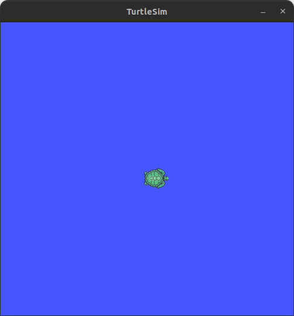

# Using Jupyter Notebooks with Flowcean

This example demonstrates how to use Jupyter Notebooks to work with the Flowcean framework.

This example is created using the package [turtlesim](http://wiki.ros.org/turtlesim), a tool designed for teaching the Robot Operating System (ROS). The example trains models to predict the next pose of the turtle, $\textbf{x}_{k+1}$, based on the current pose $\textbf{x}_{k}$ and velocity commands $\textbf{u}_{k}$.

ROS uses _topics_ to communicate between _nodes_. Nodes are processes that perform computations. They can **subscribe** to topics (receive messages from other nodes) or **publish** on topics (send messages to other nodes). In this example, the velocity commands are published to the `/turtle1/cmd_vel` topic by the turtle's teleop node (a node that lets you control the turtle interactively). The turtlesim node receives these velocity commands by subscribing to `/turtle1/cmd_vel` and publishes the turtle's pose to `/turtle1/pose`.

You can record ROS bag files using the _rosbag_ command-line tool. A ROS bag is a file format for storing ROS message data. It is commonly used for logging data during robot operation, which can later be played back for analysis or testing.
The tutorial uses ROS bag data recorded from turtlesim, processes it into supervised samples, trains multiple models, evaluates them using several metrics, and plots predictions versus ground truth.

For more information, please refer to the Jupyter notebook provided in the `examples/jupyter_notebook/` directory.
