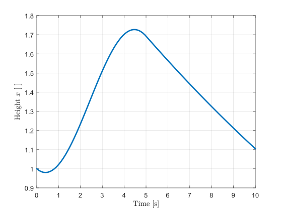

# One-Tank Example

This example shows how to train two different models to predict the time-series behavior of a single water tank with a height-dependent outflow and a time-varying inflow.
It is inspired by the one-tank simulink model used for control design [^1].
A schematic drawing of the system is shown in the following figure.


The complete source code for this example can be found [in the repository](https://github.com/flowcean/flowcean/blob/main/examples/one_tank/run.py).
See also [Run this example](#run-this-example) on how to run this example locally.

The dynamics of the system follow an ordinary differential equation (ODE).
ODEs describe the derivative of a variable (e.g. it's change over time) as a function of the variable itself.

For this example the system is described by the equation

$$ \dot{x} = \frac{b V(t) - a \sqrt{x}}{A} $$

where $x$ is the water level in the tank, $\dot{x}$ is the change of the water level over time, $V(t)$ is the time-dependent inflow, $A$ is the tank area, and $a$ and $b$ are scaling constants for the equation.
The solution of an ODE is not a single value, but a function (here $x(t)$) or a series of it's values for different times $t$.
As solving this ODE analytically is quite complicated, a numerical solver is used which compute solution points starting from an initial value.
In this example, the initial value is the initial level of the liquid $x(0) = x_0$ in the tank.

The free parameters from the above equation are set to

 $A$ | $b$ |  $a$
-----|-----|------
 $5$ | $2$ | $0.5$

The inflow is given by $V(t) = \mathrm{max}\left(0, \sin\left( 2 \pi \frac{1}{10} t \right)\right)$ and the initial condition is $x_0 = 1$.
Using a suitable numerical solution algorithm, the equation can be solved for the level $x_n$.
Since the solution is not continuous, the level is not a function of time, but a discrete function of the sample number $n$.
The corresponding time can be calculated by multiplying the sample number $n$ by the step size $T$ between two samples.
The graph below shows the development of the water level $x$ from zero to ten seconds.



## Learning Models

After setting up the simulation, we want to use two different learners to predict the level of the tank $x[n]$ given the current input $V[n]$ and the level and input in the previous two time steps.
The unknown function we are looking for and that we want to learn is

$$ x_n = f\left(V_n, x_{n-1}, V_{n-1}, x_{n-2}, V_{n-2}\right). $$

To do this, we first need data to learn the functions representation in Flowcean.
Normally this data would be recorded from a real CPS and imported into the framework as a CSV, ROS bag or something similar.
However, since we know the differential equation describing the system behavior, we can also use this equation to generate data.
We can do this by using an [`ODEEnvironment`](../reference/flowcean/environments/ode_environment.md) to model the ODE as an [`IncrementalEnvironment`](../reference/flowcean/core/environment/incremental.md) within the framework.

To do so, a special `OneTank` class is created which inherits from the general flowcean `OdeSystem` class.

```python
class OneTank(OdeSystem[TankState]):
    def __init__(
        self,
        *,
        area: float,
        outflow_rate: float,
        inflow_rate: float,
        initial_t: float = 0,
        initial_state: TankState,
    ) -> None:
        super().__init__(
            initial_t,
            initial_state,
        )
        self.area = area
        self.outflow_rate = outflow_rate
        self.inflow_rate = inflow_rate

    @override
    def flow(
        self,
        t: float,
        state: NDArray[np.float64],
    ) -> NDArray[np.float64]:
        pump_voltage = np.max([0, np.sin(2 * np.pi * 1 / 10 * t)])
        tank = TankState.from_numpy(state)
        d_level = (
            self.inflow_rate * pump_voltage
            - self.outflow_rate * np.sqrt(tank.water_level)
        ) / self.area
        return np.array([d_level])
```

The `OneTank` class describes the differential equation in the `flow` as well as all parameters needed to evaluate it.
The type parameter `TankState` is used to map the general numpy array holding the current state of the simulation to a more tangible representation.
The state of an `ODESystem` can also be used for systems with multiple states, where the behavior might change when certain conditions are met.
For this example with only a single state the `TankState` class simply maps the water level in the tank to the first entry in the state vector

```python
class TankState(State):
    water_level: float

    @override
    def as_numpy(self) -> NDArray[np.float64]:
        return np.array([self.water_level])

    @classmethod
    @override
    def from_numpy(cls, state: NDArray[np.float64]) -> Self:
        return cls(state[0])
```

The `ODESystem` can now be constructed by creating an instance of the `OneTank` class with the parameters given above

```python
    system = OneTank(
        area=5,
        outflow_rate=0.5,
        inflow_rate=2,
        initial_state=TankState(water_level=1),
    )
```

From the system, an `OdeEnvironment` can be constructed

```python
    data_incremental = OdeEnvironment(
        system,
        dt=0.1,
        map_to_dataframe=lambda ts, xs: pl.DataFrame(
            {
                "t": ts,
                "h": [x.water_level for x in xs],
            },
        ),
    ).load()
```

Beside the ODE, the time resolution `dt` and the mapping function `map_to_dataframe` are passed to the constructor.
The mapping function describes how the generated solutions for different points in time can be mapped into a data frame for further processing within Flowcean.

The generated output of the `OdeEnvironment` environment has the form

   $x$      |  $V$
  ----------|-----------
   $x[0]$   |  $V[0]$
   $x[1]$   |  $V[1]$
   $\dots$  |  $\dots$
   $x[N]$   |  $V[N]$

Since the learners we will use later only support learning on a fixed amount of data (called "[offline learners](../user_guide/learning_strategies.md)" in the framework), we need to convert the incremental dataset into a fixed size dataset.
This can be done by calling the [`collect(N)`](../reference/flowcean/core/environment/incremental.md#flowcean.core.environment.incremental.IncrementalEnvironment.collect) method on any `IncrementalEnvironment` to get $N$ samples and feed those into a [`Dataset`](../reference/flowcean/environments/dataset.md).

```python
data = Dataset(data_incremental.load().take(250))
```

Until now, the data is in a time series format with each row representing a sampled value at the step $n$.
However, for our prediction of the current fill level $x[n]$, as described by the equation above, we need the current input $V[n]$ and the values of the two previous time steps as a single sample.
To achieve this we use a [`SlidingWindow`](../reference/flowcean/transforms/index.md#flowcean.transforms.SlidingWindow) transform.
See the linked documentation for a more detailed explanation of how the transform works.

```python
data = data.with_transform(SlidingWindow(window_size=3))
```

Now that the data is in the correct format, it can be split into a test set with 80% of the samples and a training set with the remaining 20%.
This is done by using a [`TrainTestSplit`](../reference/flowcean/environments/train_test_split.md) operation and helps with evaluating the learned models performance after training.
To make the learning less biased, the samples are shuffled before splitting.

```python
train, test = TrainTestSplit(ratio=0.8, shuffle=True).split(data)
```

With the training data generated, fully transformed and split it's time to use learning algorithms to learn the prediction function from the beginning of this section.
We use two different learners which both belong the category of [offline learners](../user_guide/learning_strategies.md).

First, a [regression tree](../reference/flowcean/learners/regression_tree.md) is used to learn a model.
The implementation of this learner is part of the scikit-learn library.
The learned model consists of a sequence of binary questions / comparisons that lead to the model result.
The maximum depth, i.e. the number of questions asked on each path, is limited to five.
The learner class is created and the helper method [`learn_offline`](../reference/flowcean/strategies/offline.md#flowcean.strategies.offline.learn_offline) called to start the training process

```python
regression_learner = RegressionTree(max_depth=5)
regression_model = learn_offline(
    train,
    regression_learner,
    inputs,
    outputs,
)
```

The `inputs` and `outputs` variables contain the names of the input and output fields in the `train' dataframe.

Secondly a [multi-layer perceptron](../reference/flowcean/learners/lightning.md) is used to create a model.
This type of model consists of a set of neurones arranged in layers which are connected with the previous layer.
The value of each neuron is calculated by weighting and summing up the values of the neurons in the previous layer and applying a non-linear function; in this case a [leaky ReLU function](https://en.wikipedia.org/wiki/Rectifier_(neural_networks)#Leaky_ReLU).
The result can be read from the neurons of the last layer.
The implementation of this learner uses the [lightning framework](https://lightning.ai/docs/pytorch/stable/) which is a high-level wrapper around the well known [PyTorch](https://pytorch.org/) library.

```python
perceptron_learner = LightningLearner(
    module=MultilayerPerceptron(
        learning_rate=1e-3,
        input_size=len(inputs),
        output_size=len(outputs),
        hidden_dimensions=[10, 10],
        ),
    max_epochs=100,
)
perceptron_model = learn_offline(
    train,
    perceptron_learner,
    inputs,
    outputs,
)
```

The final step is to evaluate the obtained models.
This is done to estimate how well they are able to describe the unknown function as described above.
Flowcean ships with a couple of different [metrics](../reference/flowcean/metrics/index.md) which can be used for this purpose.
Depending on the underlying problem, different metrics can be reasonable to apply.
For this example the [`MeanAbsoluteError`](../reference/flowcean/metrics/index.md#flowcean.metrics.MeanAbsoluteError) and [`MeanSquaredError`](../reference/flowcean/metrics/index.md#flowcean.metrics.MeanSquaredError) error are used.
These metrics are useful when the output of the learned function is a (more or less) continuous value and the deviation from the actual value is of interest.
The helper method [`evaluate_offline`](../reference/flowcean/strategies/offline.md) allows for easy evaluation of multiple metrics for a learned model.

```python
regression_report = evaluate_offline(
    regression_model,
    test,
    inputs,
    outputs,
    [MeanAbsoluteError(), MeanSquaredError()],
)

perceptron_report = evaluate_offline(
    perceptron_model,
    test,
    inputs,
    outputs,
    [MeanAbsoluteError(), MeanSquaredError()],
)
```

For this example, the resulting metrics are about

 Learner typ            | Runtime              | Mean Absolute Error | Mean Squared Error
 -----------------------|----------------------|---------------------|--------------------
 Regression Tree        | $15.5\: \mathrm{ms}$ | $0.0206$            | $0.0006$
 Multi-layer Perceptron | $813\: \mathrm{ms}$  | $0.0639$            | $0.00054$

Depending on the size of the dataset, the way the train and test set are split and shuffled, the learners configuration and other random facts, these values may vary.
However, it is clear, that both learners produced models with relative small errors ($\sim 2\%$ and $\sim 6\%$) which could be used for tasks such as prediction.

## Run this example

To run this example first make sure you followed the [installation instructions](../getting_started/preparation.md) to setup python and git.
Afterwards you can either use `hatch` or run the examples from source.

### Hatch

The easiest way to run this example is using `hatch`.
Follow the [installation guide](../getting_started/installation.md) to clone flowcean but stop before installing it or any of its dependencies.
Now you can run the example using

```sh
hatch run examples:one_tank
```

This command will take care of installing any required dependencies in a separate environment.
After a short moment you should see the learning results from both methods and the achieved metric values.

### From source

Follow the [installation guide](../getting_started/installation.md) to install flowcean and it's dependencies from source.
Afterwards you can navigate to the `examples` folder and run the examples.

```sh
cd examples/one_tank
python run.py
```

[^1]: <https://de.mathworks.com/help/slcontrol/ug/watertank-simulink-model.html>.
