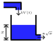

# One-Tank Incremental Learning

This example identifies a one-step predictor from the same deterministic water-tank simulation as the [offline learning variant](one_tank.md). The difference is the learning strategy: training observations are delivered in order, one row at a time, to an incremental learner.



## Shared System and Data

The water level $x$ follows

$$
\dot{x} = \frac{b V(t) - a \sqrt{x}}{A},
$$

with tank area $A = 5$, outflow rate $a = 0.5$, inflow rate $b = 2$, initial level $x(0) = 1$, and

$$
V(t) = \max\left(0, \sin\left(2 \pi t / 10\right)\right).
$$

[`examples/one_tank/system.py`](https://github.com/flowcean/flowcean/blob/main/examples/one_tank/system.py) defines this model once as a single-location `HybridSystem` with no transitions. `simulate_one_tank()` simulates 0 to 25 seconds at 0.1-second intervals and returns the sampled `t` and `h` columns used by both examples.

A three-sample `SlidingWindow` creates `h_0`, `h_1`, and `h_2`. The learner predicts the next level `h_2` from `h_0` and `h_1`.

## Incremental Workflow

[`run_incremental.py`](https://github.com/flowcean/flowcean/blob/main/examples/one_tank/run_incremental.py) performs these steps:

1. Simulate the shared one-tank system and construct sliding-window samples.
2. Split the ordered observations into 80 percent training and 20 percent test data without shuffling.
3. Wrap the training partition in a `StreamingOfflineEnvironment` with batch size 1.
4. Train a River `HoeffdingTreeRegressor` through `RiverLearner` and `learn_incremental`.
5. Evaluate the final model on the fixed holdout data with mean absolute error and mean squared error.

This preserves the incremental-learning intent while using the same simulation and evaluation boundary as the offline example. The script prints the training time and evaluation report.

## Run

From the repository root:

```sh
uv run --directory ./examples/one_tank python run_incremental.py
```

To run both one-tank variants:

```sh
just examples-one_tank
```

See [Learning Strategies](../user_guide/learning_strategies.md) for the distinction between offline and incremental learning.
