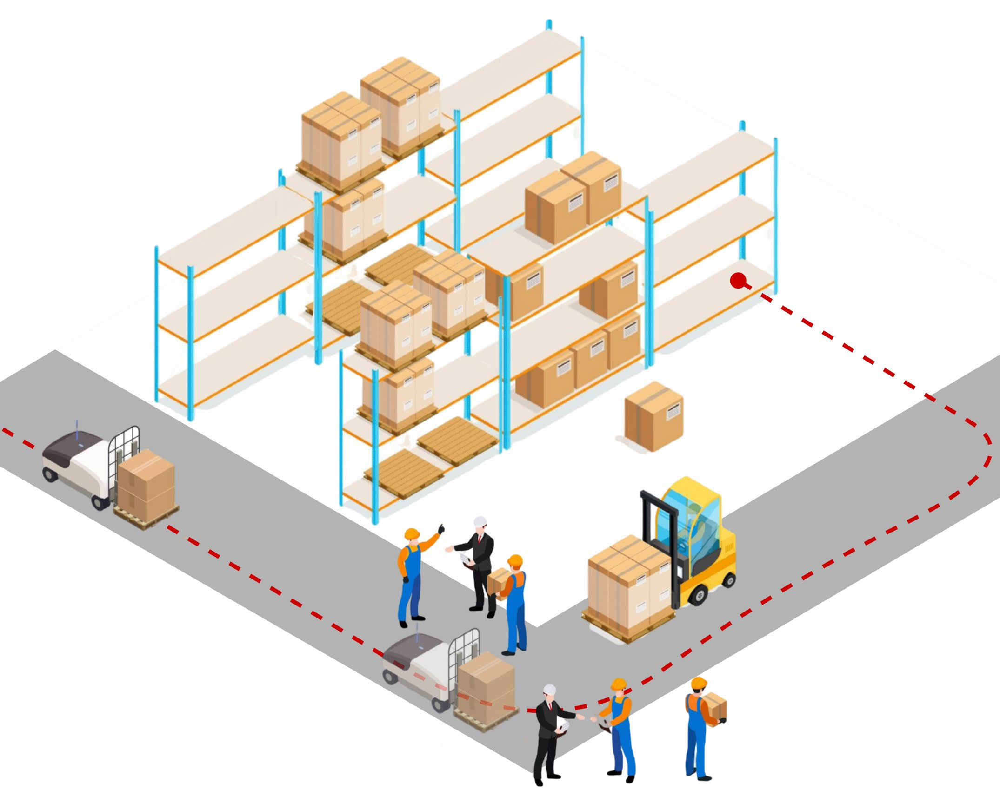

# Robot Localization Failure

Highly dynamic environments as the one depicted below still remain a challenge for localization systems of mobile robots.
Predictively monitoring the performance of robot localization systems improves the reliability and efficiency of autonomous navigation.


This example (which can be found in [flowcean/examples/ros_offline](https://github.com/flowcean/flowcean/tree/main/examples/robot_localization_failure)
) is assuming the robot utilizes the Robot Operating System(ROS) which is a software framework that is widely used in the robotics community. We are using the version [ROS 2 Humble](https://docs.ros.org/en/humble/index.html).
ROS allows users to record robotics data, such as sensor data or internal data of running processes in so called *rosbags*. Flowcean supports rosbag data using its `RosbagLoader` environment. Here is a code snippet from the `run.py`.

```python
from flowcean.environments.rosbag import RosbagLoader

environment = RosbagLoader(
            path="rec_20241021_152106",
            topics={
                "/amcl_pose": [
                    "pose.pose.position.x",
                    "pose.pose.position.y",
                ],
                "/momo/pose": [
                    "pose.position.x",
                    "pose.position.y",
                ],
                "/scan": [
                    "ranges",
                ],
                "/particle_cloud": ["particles"],
                "/position_error": ["data"],
                "/heading_error": ["data"],
            },
            msgpaths=[
                "/opt/ros/humble/share/sensor_msgs/msg/LaserScan.msg",
                "/opt/ros/humble/share/nav2_msgs/msg/ParticleCloud.msg",
                "/opt/ros/humble/share/nav2_msgs/msg/Particle.msg",
            ],
        )
```

The `RosbagLoader` requires a list of ROS topics to be loaded along with a specification which fields of the ROS message should be extracted. Here is a brief explanation of the topics that are loaded in this example:

- `/amcl_pose`: this is the pose that the localization algorithm of the robot estimates. AMCL stands for Adaptive Monte Carlo Localization and is a commonly used localization approach using a range sensor, e.g. a LiDAR sensor.
- `/momo/pose`: this is the pose provided by a motion capturing system that is installed in our lab. This data is used to determine the error of the data provided by AMCL.
- `/scan`: this is the data from the LiDAR sensor.
- `/particle_cloud`: AMCL is a probabilistic localization approach that uses a set of particles (possible poses of the robot) to describe the probability distribution for the robot in space.
- `/position_error`: The position error calculated using the euclidean distance.
- `/heading_error`: The heading error in degrees.

This example is still under development. The learning pipeline and the documentation of it will be completed in the future.
