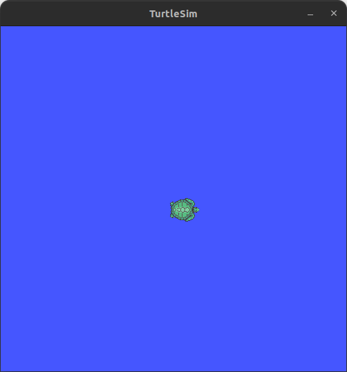

# Turtlesim Example

The package [turtlesim](http://wiki.ros.org/turtlesim) is a tool made for teaching the Robot Operating System (ROS). This example trains models to predict the next pose of the turtle $\textbf{x}_{k+1}$ based on the current pose $\textbf{x}_{k}$ and velocity commands $\textbf{u}_{k}$.


It uses ROS bag data recorded from turtlesim, processes it into supervised samples, learns multiple models, evaluates them with several metrics, and plots predictions versus ground truth.



The complete source code for this example lives in `examples/turtlesim/run.py`.

## Data and Processing Pipeline

The example expects two ROS bag directories in the config:

- Training: `rosbag.training_path`
- Evaluation: `rosbag.evaluation_path`

Topics used:

- `/turtle1/cmd_vel` with fields `linear.x`, `angular.z`
- `/turtle1/pose` with fields `x`, `y`, `theta`

`/turtle1/cmd_vel` is the desired velocity command for the turtle. It specifies the linear and angular velocities that the turtle should follow. `/turtle1/pose` provides the actual position and orientation of the turtle in the simulation environment.

The pipeline:

- Load the two topics and keep only the required fields.
- Zero-order hold to align both topics on a common time base and create a single time series (`measurements`).
- Explode the time series into per-sample rows.
- Shift pose one step into the future to form supervised labels.

The following table shows how the values of the current pose vector $\textbf{x}_{k}$ are shifted to form the next pose vector $\textbf{x}_{k+1}$.

| $ \textbf{x}_{k} $ | $ \textbf{u}_{k} $     | $ \textbf{x}_{k+1} $   |
|----------------------|----------------------|----------------------  |
| [0, 0, 0]            | [1, 0]               | <span style="color:red">[5, 0, 0]</span>            |
| <span style="color:red">[5, 0, 0]</span>          | [0, 1]               | <span style="color:green">[5, 0, 2]</span>          |
| <span style="color:green">[5, 0, 2]</span>       | [5, 0]               | [7, 4, 2]            |
| ...                    | ...                | ...                    |
| [4, 2, 2]     | [0, 0]                | null                    |

Note that this results in a null value for the next pose vector in the last row, which is filtered out.
The shift is performed using this function:

```python
def shift_in_time(df: pl.LazyFrame) -> pl.LazyFrame:
    return df.with_columns(
        pl.col("/turtle1/pose/x", "/turtle1/pose/y", "/turtle1/pose/theta")
        .shift(-1)
        .name.suffix("_next"),
    ).filter(pl.col("/turtle1/pose/x_next").is_not_null())
```

Inputs and outputs used for learning:

- Inputs:
  - `/turtle1/pose/x`
  - `/turtle1/pose/y`
  - `/turtle1/pose/theta`
  - `/turtle1/cmd_vel/linear.x`
  - `/turtle1/cmd_vel/angular.z`
- Outputs:
  - `/turtle1/pose/x_next`
  - `/turtle1/pose/y_next`
  - `/turtle1/pose/theta_next`

## Learning Models

Three learners are trained:

- Regression Tree (scikit-learn)
- Random Forest Regressor (scikit-learn)
- Multi-layer Perceptron (PyTorch Lightning)

The MLP is configured via the Lightning wrapper and learns a multi-output regression mapping from the input vector to the next-step pose.

## Evaluation and Plots

Metrics:

- MaxError
- MeanAbsoluteError
- MeanSquaredError
- R2Score
- MeanEuclideanDistance (for 2D position error on x/y)

The best model is selected using MeanEuclideanDistance on the multi-output. The script also saves:

- A 2D trajectory plot comparing predicted and ground-truth x/y
- Time series plots comparing each output channel

Plots are saved under `plots/`.

## Configuration

Edit `examples/turtlesim/config.yaml`:

- Set `rosbag.training_path` and `rosbag.evaluation_path` to your bag directories.
- Ensure message paths include the required message definitions.

Example:

```yaml
rosbag:
  training_path: recordings/turtle_training
  evaluation_path: recordings/turtle_evaluation
  message_paths:
    - ros_msgs/geometry_msgs/msg/Twist.msg
    - ros_msgs/turtlesim/msg/Pose.msg
training:
  tree:
    max_leaf_nodes: 100
  forest:
    n_estimators: 100
    max_depth: 10
  mlp:
    learning_rate: 1e-3
    batch_size: 64
    max_epochs: 30
```

## Run this example

First follow the installation guide to install Flowcean and dependencies.

Then you can run the example using uv:

```sh
cd examples/turtlesim
uv run run.py
```

After execution, the console prints metric reports per model, the best model name, and saves plots to the `plots/` directory.
