# Hybrid Systems

Hybrid systems combine continuous evolution with discrete changes in behavior. Flowcean represents the active discrete mode as a location, evolves a continuous state according to that location's dynamics, and changes locations when event surfaces trigger transitions.

Use `flowcean.hybrid` to define and simulate models, and [`flowcean.hybrid.benchmarks`](../reference/hybrid.md#flowcean.hybrid.benchmarks) for reusable systems. Start with a simulation below, follow the [minimal example](../examples/hs_simple.md) to construct a model from locations and transitions, or compare systems in the [benchmark gallery](../examples/hybrid_systems.md).

## Read a Hybrid Model

The [thermostat benchmark](../examples/hybrid_systems.md#thermostat) has one continuous state, temperature, and two discrete locations, `heating` and `cooling`. Each location defines a different rate of temperature change. The target-temperature input sets a pair of switching thresholds: crossing one changes the active location without resetting the temperature.

<figure class="hybrid-figure hybrid-automaton" markdown="span">

[](../assets/hybrid_systems/thermostat-automaton.svg){ target="_blank" rel="noopener" }

<figcaption>Boxes represent locations; arrows represent transitions. The incoming arrow marks the initial location. Open a figure to inspect it at full size.</figcaption>

</figure>

Other systems also change the continuous state at a transition. For example, a [bouncing ball](../examples/hybrid_systems.md#bouncing-ball) reverses and reduces its velocity at impact through a reset, while remaining in the same flight location.

## Simulation

Create a system and supply a time span and input signal. This example runs the [thermostat](../examples/hybrid_systems.md#thermostat) with a slowly varying target temperature:

```python
import numpy as np

from flowcean.hybrid import simulate
from flowcean.hybrid.benchmarks import thermostat

system = thermostat()
trace = simulate(
    system,
    t_span=(0.0, 10.0),
    input_stream=lambda t: np.array([22.0 + 0.8 * np.sin(0.7 * t)]),
    sample_dt=0.02,
)
```

The returned `Trace` contains sample times, continuous states, active location labels, residence times, and transition events.

<figure class="hybrid-figure" markdown="span">

[](../assets/hybrid_systems/thermostat-trace.svg){ target="_blank" rel="noopener" }

<figcaption>Temperature remains continuous when the mode changes, but its derivative changes. Shading identifies the active location.</figcaption>

</figure>

The simulator also accepts initial-state, initial-location, and initial-residence-time overrides, solver tolerances, and an event limit. Set `capture_derivatives=True` when a workflow needs state derivatives, and use `trace_to_polars` to prepare tabular state, input, and derivative columns for identification or evaluation.

See the [simulator API](../reference/hybrid.md#flowcean.hybrid.simulate) for the complete signature. The sections below explain model construction and the precise meaning of events, samples, and transition boundaries.

## Model and Continuous Evolution

The objects used to construct a model are available from `flowcean.hybrid`:

```python
from flowcean.hybrid import (
    ContinuousDynamics,
    CrossingDirection,
    EventSurface,
    HybridSystem,
    Location,
    Reset,
    SurfaceEntryPolicy,
    Transition,
)
```

A `HybridSystem` contains locations, transitions, an initial location, an initial continuous state, and global parameters. Exactly one location is active at each point in the simulation. A same-time transition chain may visit several locations at one physical time, ordered by microsteps. Between transitions, the active location's `ContinuousDynamics` callback returns the derivative of the continuous state.

The continuous state is a one-dimensional NumPy array. A system with continuous dynamics but no discrete switching is represented by one location and no transitions.

Callbacks can use the physical time, location residence time, continuous state, effective parameters, and input stream:

```python
def flow(t, state, parameters, input_stream):
    control = input_stream(t)
    return parameters["gain"] * state + control
```

Callbacks may declare only the arguments they need when they retain the canonical names `t`, `location_time`, `state`, `parameters`, and `input_stream`. For example, a flow that depends only on state and parameters can use `def flow(state, parameters): ...`. Keyword-only arguments are supported, and callbacks using named dispatch with `**kwargs` receive all five values. Legacy callbacks using positional-only arguments, `*args`, or noncanonical required names still receive the original four positional arguments `(t, state, parameters, input_stream)`; request `location_time` through named dispatch instead.

System parameters apply globally, while parameters declared on the active location override global values with the same name. An input stream is a callable that returns a one-dimensional input array for a requested physical time.

## Transitions and Resets

A transition connects one source location to one target location. Its event surface is a scalar function whose zero crossing can trigger the transition. `CrossingDirection.RISING`, `FALLING`, and `EITHER` restrict which crossing directions are accepted during continuous evolution.

An event surface describes a numerical zero crossing, not a Boolean region. For example, a falling surface does not fire merely because its value is already negative. Whenever simulation enters a location—including the initial location—the simulator evaluates every outgoing surface exactly once before deciding what to do. A value equal to `0.0` (including `-0.0`) is on the surface. Arbitrarily small nonzero values and positive or negative infinity retain their sign; NaN is invalid.

Each transition's `entry_policy` determines what exact zero means on entry:

- `SurfaceEntryPolicy.ERROR` (the default) raises `SurfaceEntryError`, requiring the model to make its intent explicit.
- `SurfaceEntryPolicy.TRIGGER` performs the transition immediately at the same physical time.
- `SurfaceEntryPolicy.CONTINUE` leaves the transition inactive for entry handling and passes the zero-valued surface unchanged to continuous integration. Use this when a trajectory naturally enters a boundary and departs in the direction opposite to the transition.

Entry decisions are atomic. NaN takes precedence over every policy. Any zero `ERROR` surface is reported before trigger selection. More than one zero `TRIGGER` surface raises `AmbiguousTransitionError`; exactly one performs a jump, applies its reset, enters the target, and repeats entry evaluation there. A `CONTINUE` surface does nothing during entry handling.

For each settled continuous segment, the simulator:

1. Integrates the active location's dynamics until the earliest detected outgoing event or the end of the time span.
2. Records the state immediately before the transition.
3. Applies the optional reset using the source location's effective parameters.
4. Enters the target location and resolves its entry policy before integrating again.

Without a reset, the continuous state is unchanged by a transition. Every transition starts a new location visit and resets `location_time` to zero, including self-transitions; a separate state reset is optional. Reset callbacks receive the source location's residence time, while target-entry surfaces receive zero. A reset normally returns a one-dimensional state with the same dimension as the state before the transition. A scalar is also accepted for a single-state system.

!!! warning "Simultaneous entry transitions"

    Multiple exact-zero `TRIGGER` surfaces on one location entry are ambiguous and stop simulation. Design the entry state or policies so that at most one requests an immediate jump.

## Automaton Diagrams

Use `build_hybrid_system_dot` to inspect a system's complete declared structure without simulating it. The graph includes every location and transition, even those a trace never visits, with an incoming arrow marking the initial location.

```python
from pathlib import Path

from flowcean.hybrid import build_hybrid_system_dot, render_dot_svg
from flowcean.hybrid.benchmarks import thermostat

dot = build_hybrid_system_dot(
    thermostat(),
    show_direction=True,
    show_entry_policy=True,
)
Path("thermostat.dot").write_text(dot, encoding="utf-8")
```

Event and reset labels are shown by default; disable them with `show_event_labels=False` or `show_reset_labels=False`. Crossing direction and entry policy are opt-in annotations. Labels are literal display text, not formulas inferred from callback bodies. When explicit labels are absent, callback names or positional fallback labels are used. Duplicate labels do not merge locations. Node IDs and DOT ordering follow declaration order, so reordering the model changes the output.

DOT export requires no renderer and evaluates no dynamics, event, reset, or input callbacks. To render an SVG, install [Graphviz](https://graphviz.org/download/) with its `dot` executable on `PATH`, then:

```python
svg = render_dot_svg(dot)
Path("thermostat.svg").write_text(svg, encoding="utf-8")
```

Rendering returns text without writing files or opening a viewer. A missing renderer or failed Graphviz command raises `RuntimeError`. SVG layout may vary between Graphviz versions.

## Location Residence Time

`location_time` measures elapsed physical time in the current location visit. The simulator maintains it separately from the continuous state, so models need neither an extra clock coordinate nor a clock derivative or reset.

A timeout is an ordinary rising event surface:

```python
timeout = EventSurface(
    lambda location_time: location_time - 5.0,
    direction=CrossingDirection.RISING,
)
```

Use this surface on a transition to leave its source after five time units. Flows and resets can also request `location_time`, while `t` always remains global simulation time.

By default, the initial visit starts at residence time zero even when `t_span` begins at a nonzero time. To start partway through a visit, pass `initial_location_time` to `simulate` or `generate_traces`. It must be finite and nonnegative; batch generation applies the same initial age to every trace. Subsequent transitions always reset residence time to zero, including each jump in an immediate transition chain.

Residence-time surfaces retain zero-crossing semantics. For the timeout above, starting at age five follows the transition's exact-zero entry policy; starting after age five does not trigger an overdue timeout automatically. `CONTINUE` does not suppress a root detected at the integration start and can still lead to `SimulationProgressError`. Combining a minimum dwell time with a Boolean condition is not an additional guard mechanism provided by this clock.

## Physical Time and Microsteps

`Event.time` is physical simulation time. Immediate transitions on location entry do not advance physical time. Their zero-based `microstep` values preserve their order within the same-time transition chain. An initial-entry trigger has microstep 0. A continuously detected crossing also has microstep 0, and triggers on successive target entries use microsteps 1, 2, and so on.

Suppose a transition from A to B resets the state onto an event surface in B, which immediately causes a transition from B to C:

| Record | Physical time | Microstep | Location change | Recorded state |
| --- | ---: | ---: | --- | --- |
| First event | 1.0 | 0 | A -> B | `state_before` in A and `state_after` in B |
| Second event | 1.0 | 1 | B -> C | `state_before` in B and `state_after` in C |
| Trace row | 1.0 | - | C | Final state after the complete chain |

Every transition in the chain counts toward `max_jumps`. Simulation raises an error if that limit is exceeded.

After a continuous crossing, integration restarts at the exact event time with the post-jump state; the simulator does not offset time to move away from the root. A location must be settled before this restart. If the ODE solver nevertheless returns an event at or before the segment start, simulation raises `SimulationProgressError` rather than applying the transition. This usually indicates stateful callbacks, a discontinuous event surface, or insufficient floating-point time resolution; use deterministic callbacks and continuous surfaces.

## Trace Boundary Semantics

Flat traces are right-continuous at transitions. A trace row at an event time contains the final state and active location after the complete immediate transition chain. This rule also applies to transitions at the initial or final time.

Each `Event` preserves the individual jump through independent `state_before` and `state_after` snapshots. Its `location_time_before` records the source visit's age, and `location_time_after` is zero. The event sequence therefore retains intermediate states even though the flat trace contains only the final post-chain value at that physical time.

A `Trace` contains aligned simulation records:

| Field | Contents |
| --- | --- |
| `t` | Physical sample times |
| `x` | Continuous state at each sample time |
| `location` | Active location label at each sample time |
| `location_time` | Residence time in the active visit, zero at post-transition boundaries |
| `events` | Ordered transition events with pre-reset and post-reset states |
| `u` | Captured inputs, when requested |
| `dx` | Captured state derivatives, when requested |

Residence times are required fields on `Trace` and `Event`. Trace conversion and CSV/Parquet exports always include a separate `location_time` column; it is not a state feature in `Trace.x`.

## Sampling

The sampling options determine which physical times appear in the flat trace:

- Without `sample_times` or `sample_dt`, the trace uses the adaptive time points returned by the ODE solver. Detected event times are included.
- `sample_times` returns exactly the requested, non-descending times within `t_span`.
- `sample_dt` creates a fixed grid from the start of `t_span` and includes the final endpoint, even when the interval is not an exact multiple of the step.
- `sample_times` and `sample_dt` cannot be used together.

A fixed sampling grid is not expanded with off-grid transition times. Those transitions remain available through `Trace.events`. If a requested sample coincides with a transition, the sample follows the right-continuous boundary rule.

When an input stream is supplied, inputs are captured by default unless `capture_inputs=False` is selected. Setting `capture_derivatives=True` reevaluates the active location's dynamics at each returned sample. At a transition boundary, the derivative therefore uses the final target location and post-transition state. Derivative capture assumes that flow callbacks are pure under repeated evaluation.

## Plotting Locations

Use `plot_trace` for state trajectories, or add location shading to your own time-series plots with `plot_locations`:

```python
import matplotlib.pyplot as plt

from flowcean.hybrid import plot_locations

fig, ax = plt.subplots()
ax.plot(trace.t, trace.x[:, 0], color="black", label="x0")
plot_locations(trace, ax=ax)
ax.set_xlabel("Time")
ax.legend()
```

`plot_locations` does not change axis labels or create a legend. Its patches carry location labels, so you can use `ax.legend()` or build a shared figure legend from `ax.get_legend_handles_labels()`. Pass the same `location_colors` mapping when comparing plots whose traces visit locations in different orders.

Shading spans the trace's first to last sample and follows recorded transition times, including locations visited between samples. If that range contains no events, a change is approximated at the first sample with the new location label. Instantaneous intermediate locations have no shaded area.

## Benchmarks and Identification

The [benchmark gallery](../examples/hybrid_systems.md) illustrates switching, hysteresis, and resets in reusable models. The [benchmark API](../reference/hybrid.md#flowcean.hybrid.benchmarks) documents factory parameters.

Import HyDRA interfaces such as `HyDRALearner`, `HyDRATraceSchema`, and `HybridDecisionTreeLearner` from `flowcean.hybrid.hydra` to identify mode dynamics and selectors from sampled traces. Selector-specific APIs are also available from `flowcean.hybrid.hydra.selector`.

`HyDRAModel.simulate()` selects a mode at every requested grid point, including the final endpoint. Trace labels and residence times reflect that selection: residence time starts at zero and resets whenever the selected mode changes, including re-entry into an earlier mode. Between grid points, the selected mode stays fixed. This grid-based simulation does not locate within-interval switches or produce transition events.

Follow the [simulated hybrid system identification](../examples/simulated_hybrid_system.md) workflow to learn a two-location affine system from traces. See the [HyDRA API](../reference/hybrid.md#flowcean.hybrid.hydra) for identification interfaces and the [modeling API](../reference/hybrid.md#flowcean.hybrid) for system and trace types.
