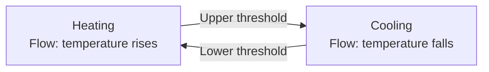

# Hybrid Systems

Hybrid systems combine continuous change with discrete switches. A thermostat is a simple example: temperature varies continuously while the controller switches between heating and cooling.

## Read a Hybrid Automaton

A **hybrid automaton** describes the possible configurations of a system and the rules for moving between them. This thermostat sketch shows the continuous behavior inside each configuration:


```mermaid
flowchart LR
    accTitle: Thermostat hybrid automaton
    accDescr {
        Heating and cooling are locations. Their flows raise and lower
        temperature. Crossing the upper threshold switches to cooling;
        crossing the lower threshold switches to heating.
    }
    heating["Heating<br/>Flow: temperature rises"]
    cooling["Cooling<br/>Flow: temperature falls"]
    heating -->|Upper threshold| cooling
    cooling -->|Lower threshold| heating
```

Temperature is the **continuous state**. Heating and cooling are **locations**, the discrete configurations in which the system can operate. Each location selects a **flow**, a law for the rate of change of the continuous state. Together, the continuous state and active location describe the system's current situation.

The arrows are **transitions**, discrete steps from one location to another or back to the same location. Each transition has an **event surface**, a boundary whose crossing can trigger it. Here, the boundaries are temperature thresholds. An **event** is an occurrence of a transition during a particular run.

The two thresholds create **hysteresis**: between them, the same temperature can occur during either heating or cooling. Knowing the temperature alone is therefore insufficient to determine its rate of change; the active location matters too.

A transition can also apply a **reset**, an instantaneous change to the continuous state. The thermostat keeps its current temperature when it switches. A [bouncing ball](../examples/hybrid_systems.md#bouncing-ball), by contrast, reverses its velocity at impact through a reset while remaining in the same flight location.

## Describe a Model

In Flowcean, a [`HybridSystem`][flowcean.hybrid.HybridSystem] brings together locations, their flows, and their transitions. You also choose the initial continuous state and active location. The [minimal model example](../examples/hs_simple.md) shows how to construct these pieces; the [benchmark gallery](../examples/hybrid_systems.md) provides ready-made models to explore.

Separate **inputs**, external signals that vary during a run, from **parameters**, the settings that define the model. For the thermostat, the desired temperature is an input, while heating strength and the width of the hysteresis band are parameters. This separation lets you reuse the same model under different operating conditions.

Express an event surface as a function that is zero at the switching boundary. For the upper thermostat threshold, subtract that threshold from the current temperature and detect a crossing from negative to positive. If an initial condition or reset puts the state exactly on a boundary, [entry policies][flowcean.hybrid.SurfaceEntryPolicy] determine what happens on entering that location: take the transition immediately, begin continuous evolution, or report an error.

### Location Residence Time

Some transitions depend on how long a configuration has been active rather than on temperature or another state quantity. **Location residence time** is the elapsed time in the current visit; every transition starts a new visit, including a transition back to the same location. A [timed-switch model](../examples/hybrid_systems.md#time-forced-switch), for example, can use residence time to alternate configurations after a fixed duration.

## Simulate a Run

Use [`simulate`][flowcean.hybrid.simulate] to follow a model over a chosen time interval, supplying any external inputs. This example uses the predefined [`thermostat`][flowcean.hybrid.benchmarks.thermostat.thermostat] model with a slowly varying target temperature:

```python
import numpy as np

from flowcean.hybrid import simulate
from flowcean.hybrid.benchmarks import thermostat

system = thermostat()
trajectory = simulate(
    system,
    t_span=(0.0, 10.0),
    input_stream=lambda t: np.array([22.0 + 0.8 * np.sin(0.7 * t)]),
)
```

The result is a [`HybridTrajectory`][flowcean.hybrid.HybridTrajectory], a record of one execution of the model. It contains **continuous segments**, each governed by one active location's flow, and the events between them. In the thermostat run below, temperature remains continuous at a switch, but its rate of change changes.

<figure class="hybrid-figure" markdown="span">

[](../assets/hybrid_systems/thermostat-trace.svg){ target="\_blank" rel="noopener" }

<figcaption>The temperature follows a moving target. Shading identifies the active location; the switching thresholds are drawn alongside the temperature.</figcaption>

</figure>

For visual inspection, [`plot_trajectory`][flowcean.hybrid.plot_trajectory] shows continuous states against time. For models with several state quantities, [`plot_state_space`][flowcean.hybrid.plot_state_space] plots one coordinate against another. Both views preserve the separate continuous segments at resets, so a jump is distinguishable from continuous motion.

An execution can contain several events at one physical time. For example, a reset may place the state on a boundary that requests an immediate further transition. The trajectory preserves their order. A point query or sample at that time reports the state after the complete chain.

## Sample Data for Analysis

A trajectory describes an execution; a sampled trace is a table of observations from it. Choose observation times to suit the analysis or learning method you want to use. A coarse grid may miss a short location visit, whereas the trajectory's event record preserves the transitions that delimit it.

Use [`sample`][flowcean.hybrid.HybridTrajectory.sample] to create the table. Here we include the target-temperature input and the temperature derivative, so the observations capture both the operating conditions and the rate of change described by the active flow:

```python
samples = trajectory.sample(
    dt=0.02,
    include_inputs=True,
    include_derivatives=True,
)
```

The resulting Polars frame can be selected, renamed, saved, or passed to a learning workflow. When you only need the system's situation at one instant, [`evaluate`][flowcean.hybrid.HybridTrajectory.evaluate] returns a [`TrajectoryPoint`][flowcean.hybrid.TrajectoryPoint] containing its continuous state, active location, and residence time. Use the trajectory to investigate transitions and continuous evolution, and sampled data when a method expects observations on a grid.

## Learn from Samples

Simulation starts with a specified model and produces observations. Learning works in the other direction: observations are used to fit a model of the behavior. Flowcean's [HyDRA learner][flowcean.hybrid.hydra.HyDRALearner] learns continuous flow models and a selector that chooses which flow to apply. The resulting model represents behavior through these learned flows and selection decisions, rather than through a manually specified automaton.

Follow the [hybrid identification walkthrough](../examples/simulated_hybrid_system.md) for a complete workflow from sampled states and derivatives to learned flows and predictions.
